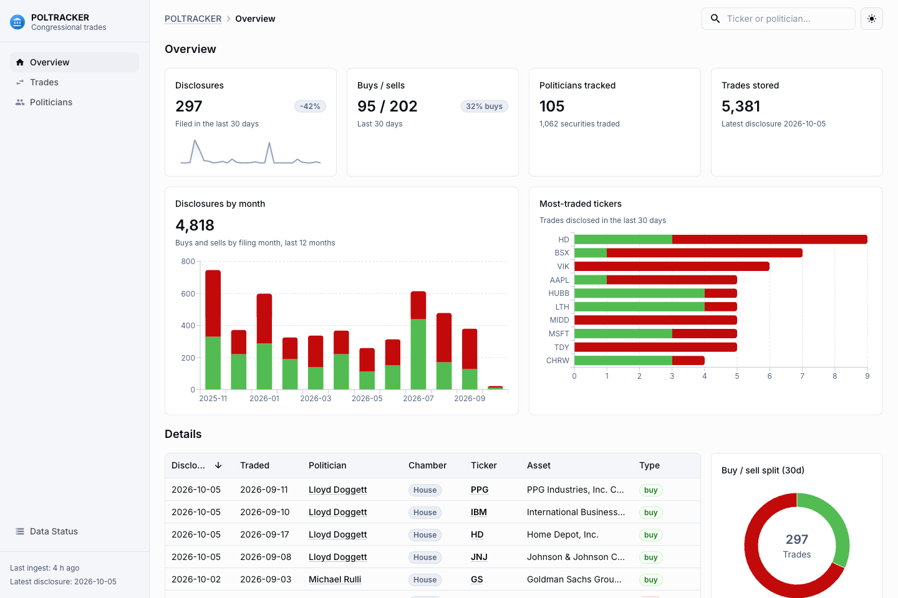
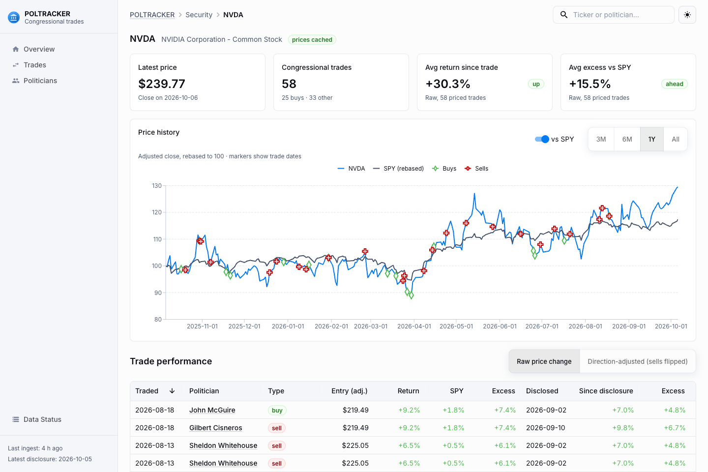
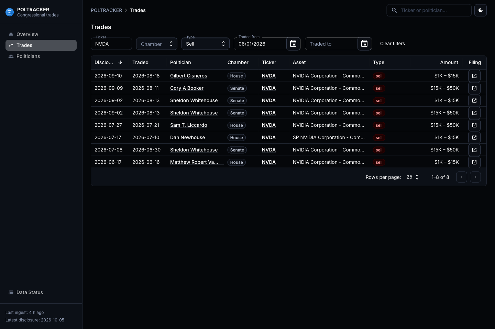
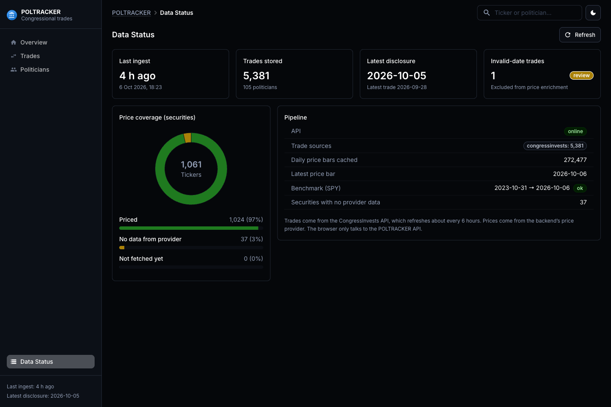
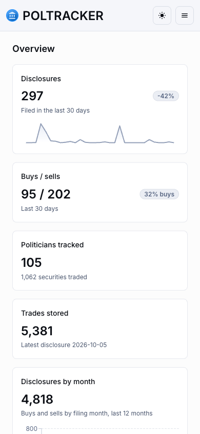

# POLTRACKER

POLTRACKER tracks stock trades that members of the U.S. Congress disclose under the STOCK Act. It ingests new
disclosures on a schedule, stores them in a local database, enriches them with market prices, and shows how each
trade has performed since it was made and since it was disclosed, compared with the S&P 500 (SPY).



| Security detail (price, SPY overlay, trade markers, per-trade performance) | Trades (dark mode) |
|---|---|
|  |  |

| Data status (dark mode) | Mobile |
|---|---|
|  |  |

> **Not investment advice.** Disclosures are filed with a delay, amounts are reported only as ranges, and past
> performance of a trade says nothing about intent or about future returns.

## Features

- **Incremental, resumable ingestion.** Pulls newest-first pages and stops as soon as a page contains nothing new, so
  a caught-up database costs one request. An interrupted first backfill (rate limit, network error) resumes where it
  left off instead of declaring itself caught up. All state lives in the database, not in memory.
- **Deterministic deduplication.** Trades have no upstream ID, so each gets a content fingerprint. Re-polling, amended
  filings, and a second data provider all map onto the same rows.
- **Price cache.** Daily bars are stored once and only missing date ranges are ever fetched. Dead tickers are
  remembered and retried on a schedule.
- **Performance analytics.** Return since the trade date and since the disclosure date, the same windows for SPY, and
  excess return. Sells also have a separate direction-adjusted view. Raw values are never altered.
- **Dashboard.** Overview, Trades (server-side paging, sorting and filters), Politicians, Politician detail,
  Security detail, and Data Status. Light and dark themes, responsive layout.
- **Provider abstractions.** Congressional data (`CongressProvider`) and prices (`PriceProvider`) sit behind
  interfaces, so no other code depends on CongressInvests or yfinance.

## Architecture

```
CongressInvests API
      │  GET /trades/recent (paged, newest first)
      ▼
CongressProvider ─► normalize ─► fingerprint / dedupe ─► SQLite ◄────────────┐
                                                           │                │
                                    PriceProvider (yfinance)│  price_bars    │
                                    batched, range-cached ──┘  (+ coverage)  │
                                                           │                │
                                          performance calculations          │
                                                           ▼                │
                                                  FastAPI  (/trades, …) ────┘
                                                           │  JSON
                                                           ▼
                           React + TanStack Query + MUI (Data Grid, Charts, Date Pickers)
```

The browser only ever talks to the POLTRACKER API. It never calls CongressInvests or yfinance.

```
backend/poltracker/
  providers/        congressinvests.py, quantengines.py (stub), prices.py (PriceProvider + yfinance)
  normalize.py      amounts, names, tickers, fingerprints
  ingest.py         incremental ingestion CLI
  prices.py         price cache and refresh
  performance.py    return / benchmark / excess calculations
  enrich.py         fetch prices + report coverage CLI
  api/              FastAPI app and schemas
  models.py         SQLAlchemy models
migrations/         Alembic migrations (0001 schema, 0002 price coverage, 0003 name merge, 0004 ingest state)
frontend/src/       Vite + React + TypeScript (pages/, components/, api/, shared-theme/)
legacy/             the original Telegram script, deprecated, kept for reference
```

## Data sources

| Data | Source | Notes |
|---|---|---|
| Congressional trades | [CongressInvests](https://congressinfor-production.up.railway.app/docs) | Senate and House disclosures, last 365 days. Free tier is 100 requests/day per IP and the upstream refreshes about every 6 hours. A full backfill is about 11 requests. |
| Daily prices | Yahoo Finance via [yfinance](https://github.com/ranaroussi/yfinance) | Unofficial. Adjusted close is used for returns. SPY is the benchmark. |
| QuantEngines | not used | `QuantEnginesProvider` is a stub. Its live dataset was empty when checked on 2026-10-06. |

## Setup

Requirements: Python 3.11+ (developed on 3.13) and Node 20.19+ or 22.12+ (developed on 24).

```bash
# 1. Backend
python3 -m venv .venv
.venv/bin/pip install -e ".[dev]"
cp .env.example .env            # optional; defaults work. Never commit .env
.venv/bin/alembic upgrade head  # creates poltracker.db

# 2. Load data (first run backfills about a year of trades, then prices for ~1,000 tickers)
.venv/bin/python -m poltracker.ingest
.venv/bin/python -m poltracker.enrich

# 3. Frontend
cd frontend && npm install
```

Run from the repository root so `.env` and `poltracker.db` resolve.

## Run

```bash
# API (http://127.0.0.1:8000, interactive docs at /docs)
.venv/bin/uvicorn poltracker.api.main:app --port 8000

# Dashboard (http://localhost:5173, proxies /api to the backend)
cd frontend && npm run dev
```

| Task | Command |
|---|---|
| Ingest new trades once | `python -m poltracker.ingest` |
| Ingest, then fetch prices | `python -m poltracker.ingest --enrich` |
| Repeat every `INGEST_INTERVAL_HOURS` (default 6) | `python -m poltracker.ingest --loop --enrich` |
| Or schedule with cron | `0 */6 * * * cd /path/to/POLTRACKER && .venv/bin/python -m poltracker.ingest --enrich` |
| Fetch prices and print coverage | `python -m poltracker.enrich` |
| Backend tests | `.venv/bin/pytest` |
| Frontend type check | `cd frontend && npx tsc -b` |
| Frontend production build | `cd frontend && npm run build` (output in `frontend/dist`) |

Configuration lives in `.env` (see `.env.example`): database URL, CongressInvests base URL and optional API key,
page size, price batch size, and benchmark ticker. For a production build, serve `frontend/dist` behind a reverse
proxy that forwards `/api` to the backend, or set `VITE_API_BASE` at build time. Deployment itself is not included.

## API

| Endpoint | Purpose |
|---|---|
| `GET /trades` | Filter by `ticker`, `politician_id`, `chamber`, `transaction_type`, `date_from`, `date_to`. Sort with `sort_by` and `order`. Paged with `limit` and `offset`. |
| `GET /trades/{id}` | One trade |
| `GET /politicians`, `GET /politicians/{id}` | Politicians with trade counts. Filter with `q` and `chamber`. |
| `GET /securities/{ticker}` | Security with price coverage and recent trades |
| `GET /securities/{ticker}/prices` | Daily bars (`start`, `end`) |
| `GET /securities/{ticker}/performance` | Per-trade performance against SPY |
| `GET /stats/overview` | Totals, daily and monthly counts, top tickers and politicians |
| `GET /status` | Ingest freshness, price coverage, data-quality counters |

## How performance is calculated

- A trade is anchored to the **first trading day on or after** the stated date, so weekends and holidays roll
  forward. If no bar exists within 7 days, the trade is left unpriced instead of guessed.
- Returns use **adjusted close** from the anchor to the latest bar, as fractions (0.10 = +10%).
- The same windows are computed for SPY. **Excess return** is the security return minus the SPY return.
- Both the transaction date and the disclosure date are used. The disclosure-based figure is what a follower could
  actually have captured.
- Raw security returns are always shown unaltered. `direction_adjusted` multiplies by +1 for buys and -1 for sells and
  is a separate, clearly labelled view. Exchanges have no direction.
- A transaction date in the future, or after its own disclosure date, is marked `invalid_date`. The source date is
  kept as is and no metrics are produced. It is not corrected.

## Known limitations

- **No party or state.** CongressInvests does not provide them, so those fields are empty.
- **Name variants are only partly merged.** Honorifics, a repeated first name (`Scott Scott Franklin`), and a single
  middle initial (`John J McGuire`/`John McGuire`) are normalised. Nicknames (`Dan`/`Daniel`), full middle names and
  suffixes are deliberately left alone, so some people can still appear twice.
- **Upstream data errors.** At least one trade has an impossible date (a 2026-12-26 transaction disclosed 2026-02-09).
  Such trades are flagged, not repaired.
- **Price gaps.** Yahoo has no data for 37 traded tickers (delisted, renamed, or acquired), covering 75 trades. A few
  more have only a stray bar far from the trade date. Delisted names stop at their last bar, so there is no
  survivorship adjustment.
- **Disclosures are approximate.** Amounts are ranges, filings lag trades by weeks, and spouse or dependent
  ownership is not distinguished.
- **History is limited** to the 365 days the upstream API exposes.
- **Free-tier limits.** 100 requests/day per IP. Ingestion stops cleanly on a 429 and resumes next run.
- **Scope.** SQLite only, no authentication, no deployment tooling, no SEC EDGAR enrichment yet.
- **Migration 0003** merges rows and cannot be downgraded. Back up `poltracker.db` before upgrading an existing
  database.
- **Bundle size.** Pages are code-split by route. First load is roughly 295 to 443 kB gzipped depending on the page.
- **Legacy credentials.** The original script once held a Telegram bot token and a Finnhub key, and they remain in
  the git history of `main`. Revoke them. History has not been rewritten.

## License and data

No license has been chosen yet. Trade data belongs to its sources and is subject to their terms.
