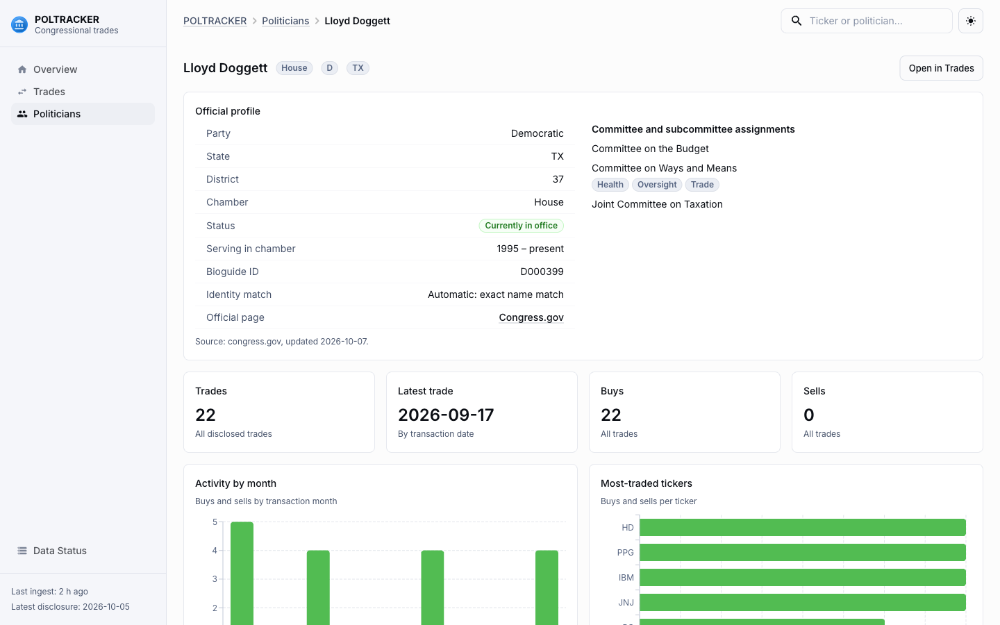

# POLTRACKER

**Congressional stock-trade analytics, as a dashboard and as a standalone Mac app.**

POLTRACKER ingests the stock trades that members of the U.S. Congress disclose under the STOCK Act, links each member
to their official record, enriches every trade with market prices, and shows how it performed since it was made and
since it was disclosed, compared with the S&P 500 (SPY).

[](https://github.com/RoamingWizards/POLTRACKER/actions/workflows/ci.yml)


| Security detail (price, SPY overlay, trade markers, per-trade performance) | Politician profile (official data, committees) |
|---|---|
|  |  |

| Trades (dark mode) | Data status (dark mode) |
|---|---|
|  |  |

> **Not investment advice.** Disclosures are filed with a delay, amounts are reported only as ranges, and past
> performance of a trade says nothing about intent or about future returns. POLTRACKER reports disclosure activity and
> price performance only; it makes no claim about wrongdoing.

## What's in it

| | |
|---|---|
| **Standalone macOS app** | `POLTRACKER.app`: double-click, no Terminal, Python, Node or hosting. Local SQLite database, automatic background refresh, works offline from cached data. [Details](docs/MACOS_APP.md) |
| **Official politician data** | Every member is matched to their stable Bioguide ID with party, state, district, term, a Congress.gov link and House committee and subcommittee seats. Deterministic matching, owner-reviewed overrides, and an opt-in, validated AI assist that never applies a match on its own. [Details](docs/POLITICIAN_ENRICHMENT.md) |
| **Trade ingestion and analytics** | Incremental, resumable, deduplicated ingestion; cached daily prices; returns versus SPY from both the trade date and the disclosure date. |
| **Dashboard** | Overview, Trades, Politicians, Politician detail, Security detail and Data Status. Light and dark themes, responsive. |
| **Production-ready backend** | Runs on SQLite or PostgreSQL, configurable CORS, stale-ingestion warning, Linux PostgreSQL CI. Nothing is deployed. [Details](docs/PRODUCTION_READINESS.md) |

## Quick start

### Mac app (Apple Silicon)

```bash
python3 -m venv .venv
.venv/bin/pip install -e ".[dev,desktop]"
./scripts/build-macos.sh            # builds release/POLTRACKER.app
open release/POLTRACKER.app
```

On first launch the app creates its database in `~/Library/Application Support/POLTRACKER/`, then loads about a year of
trades and market prices in the background while the dashboard stays usable. The build is unsigned, so a copy you
download or AirDrop will need right-click > Open once (see [docs/MACOS_APP.md](docs/MACOS_APP.md)).

### Development setup

Requirements: Python 3.11+ (developed on 3.13) and Node 20.19+ or 22.12+ (developed on 24).

```bash
# Backend
python3 -m venv .venv
.venv/bin/pip install -e ".[dev]"
cp .env.example .env                  # optional; defaults work. Never commit .env
.venv/bin/alembic upgrade head        # creates poltracker.db

# Load data (first run backfills about a year of trades, then prices for ~1,000 tickers)
.venv/bin/python -m poltracker.ingest
.venv/bin/python -m poltracker.enrich

# Optional: official politician data (needs a free CONGRESS_API_KEY; see docs/POLITICIAN_ENRICHMENT.md)
.venv/bin/python -m poltracker.enrich_politicians --overrides data/reviewed_politician_overrides.json

# Frontend
cd frontend && npm install

# Run: API on :8000 (docs at /docs) and the dashboard on :5173 (proxies /api)
.venv/bin/uvicorn poltracker.api.main:app --port 8000
cd frontend && npm run dev
```

Run from the repository root so `.env` and `poltracker.db` resolve.

| Task | Command |
|---|---|
| Ingest new trades once | `python -m poltracker.ingest` |
| Ingest, then fetch prices | `python -m poltracker.ingest --enrich` |
| Repeat every `INGEST_INTERVAL_HOURS` (default 6) | `python -m poltracker.ingest --loop --enrich` |
| Fetch prices and print coverage | `python -m poltracker.enrich` |
| Enrich politicians (dry run first) | `python -m poltracker.enrich_politicians --dry-run` |
| List politicians still unresolved | `python -m poltracker.enrich_politicians --review-queue` |
| Import an existing database into the Mac app | `python -m poltracker.desktop.importer path/to/poltracker.db` |
| Backend tests | `.venv/bin/pytest` |
| Frontend type check | `cd frontend && npx tsc -b` |
| Frontend production build | `cd frontend && npm run build` |

## Features

- **Incremental, resumable ingestion.** Pulls newest-first pages and stops as soon as a page contains nothing new, so
  a caught-up database costs one request. An interrupted first backfill resumes where it left off. All state lives in
  the database.
- **Deterministic deduplication.** Trades have no upstream ID, so each gets a content fingerprint. Re-polling, amended
  filings and a second data provider all map onto the same rows.
- **Price cache.** Daily bars are stored once and only missing date ranges are fetched. Dead tickers are remembered and
  retried on a schedule.
- **Performance analytics.** Return since the trade date and since the disclosure date, the same windows for SPY, and
  excess return. Sells also have a separate direction-adjusted view. Raw values are never altered.
- **Official politician profiles.** Party, state, district, chamber, in-office status, term, Bioguide ID, Congress.gov
  link, how the identity was matched, and House committee and subcommittee assignments.
- **Self-updating Mac app.** Refreshes on launch if data is stale and about every 6 hours while open, backs off after
  failures, shows progress without blocking the dashboard, and offers "Update now" on the Data Status page.
- **Safe by default.** Databases are backed up before any upgrade, unknown or newer databases are refused, and an
  existing `poltracker.db` can be imported without modifying the original.
- **Provider abstractions.** Congressional data (`CongressProvider`), prices (`PriceProvider`), official rosters
  (`PoliticianProvider`) and committees (`CommitteeProvider`) sit behind interfaces, so no other code depends on a
  specific source.

## How politicians are identified

Trade disclosures give a name, not an identity, and names vary (`Daniel Crenshaw` vs `Dan Crenshaw`). POLTRACKER resolves
them in a strict order and records how each one was resolved:

1. **Exact normalized match** against the official roster: same chamber, same name after folding case, accents,
   honorifics, suffixes and middle initials, and exactly one candidate.
2. **Reviewed override.** A person checks a name variant and records it, with a reason and source, in
   [`data/reviewed_politician_overrides.json`](data/reviewed_politician_overrides.json). Overrides apply only to
   politicians the matcher left unmatched and are re-validated against the live roster on every run.
3. **Optional AI assist** (OpenAI Responses API, off by default). Only for still-unmatched names; it sees the name, chamber,
   state/district and candidate names and IDs, never trade data. Its answer is an untrusted suggestion that must pass
   deterministic checks (ID in the roster and among the candidates, chamber, state, district, no duplicate ID, a single
   valid candidate, minimum confidence) and is then held in a review queue for a person to approve. It cannot create
   identities or write to the database on its own.
4. **Manual review** for anything left.

Nicknames and fuzzy spellings are never guessed. Current result: all 105 politicians resolved (84 exact, 7 extra middle
name, 14 reviewed overrides, 0 AI-resolved).

## Architecture

```
CongressInvests API ─► CongressProvider ─► normalize ─► fingerprint / dedupe ─► SQLite (or PostgreSQL)
                                                                                    ▲
Congress.gov API ──┐                                                                │
House Clerk XML ───┴► PoliticianProvider / CommitteeProvider ─► match / overrides ──┤
                                                                                    │
Yahoo Finance ─► PriceProvider ─► price cache ─► performance calculations ──────────┤
                                                                                    ▼
                                                                          FastAPI (/trades, …)
                                                                                    │ JSON
                                                                                    ▼
                                     React + TanStack Query + MUI (Data Grid, Charts, Date Pickers)

Mac app: pywebview window ◄── local FastAPI server (random 127.0.0.1 port) serving the React build and /api
```

The browser only ever talks to the POLTRACKER API. It never calls a data provider directly.

```
backend/poltracker/
  providers/        congressinvests.py, congress_gov.py, house_clerk.py, prices.py (yfinance), quantengines.py (stub)
  normalize.py      amounts, names, tickers, fingerprints
  ingest.py         incremental ingestion CLI
  prices.py         price cache and refresh
  performance.py    return / benchmark / excess calculations
  enrich.py         fetch prices + report coverage CLI
  enrich_politicians.py, politician_match.py, politician_overrides.py, politician_llm.py
                    official politician enrichment, matching, reviewed overrides, optional AI assist
  desktop/          Mac app: launcher, local server, database bootstrap and import, background refresh
  api/              FastAPI app and schemas
  models.py         SQLAlchemy models
migrations/         Alembic migrations 0001-0008 (schema, price coverage, name merge, ingest state,
                    last success, official politician data and committees, reviewed overrides, AI suggestion cache)
frontend/src/       Vite + React + TypeScript (pages/, components/, api/, shared-theme/)
packaging/macos/    PyInstaller spec and launcher for POLTRACKER.app
scripts/            build-macos.sh
data/               reviewed_politician_overrides.json
docs/               macOS app, politician enrichment, production readiness, deployment plan
legacy/             the original Telegram script, deprecated, kept for reference
```

## Data sources

| Data | Source | Notes |
|---|---|---|
| Congressional trades | [CongressInvests](https://congressinfor-production.up.railway.app/docs) | Senate and House disclosures, last 365 days. Free tier is 100 requests/day per IP; upstream refreshes about every 6 hours. A full backfill is about 11 requests. |
| Member roster and identifiers | [Congress.gov API](https://api.congress.gov/) | Needs a free `CONGRESS_API_KEY`. A full enrichment takes about 3 requests. |
| House committees | [Clerk of the House](https://clerk.house.gov/xml/lists/MemberData.xml) | Official XML, no key. |
| Daily prices | Yahoo Finance via [yfinance](https://github.com/ranaroussi/yfinance) | Unofficial. Adjusted close is used for returns. SPY is the benchmark. |
| AI assist (optional) | OpenAI Responses API | Off by default; needs `OPENAI_API_KEY`. Used only for unresolved names. |
| QuantEngines | not used | `QuantEnginesProvider` is a stub; its live dataset was empty when checked. |

## API

| Endpoint | Purpose |
|---|---|
| `GET /trades` | Filter by `ticker`, `politician_id`, `chamber`, `transaction_type`, `date_from`, `date_to`. Sort with `sort_by` and `order`. Paged with `limit` and `offset`. |
| `GET /trades/{id}` | One trade |
| `GET /politicians`, `GET /politicians/{id}` | Politicians with trade counts and official fields; the detail response adds committee assignments. Filter with `q` and `chamber`. |
| `GET /securities/{ticker}` | Security with price coverage and recent trades |
| `GET /securities/{ticker}/prices` | Daily bars (`start`, `end`) |
| `GET /securities/{ticker}/performance` | Per-trade performance against SPY |
| `GET /stats/overview` | Totals, daily and monthly counts, top tickers and politicians |
| `GET /status` | Ingest freshness, price coverage, data-quality counters |
| `GET /refresh/status`, `POST /refresh` | Mac app only: background refresh state and "Update now" |

## How performance is calculated

- A trade is anchored to the **first trading day on or after** the stated date, so weekends and holidays roll
  forward. If no bar exists within 7 days, the trade is left unpriced instead of guessed.
- Returns use **adjusted close** from the anchor to the latest bar, as fractions (0.10 = +10%).
- The same windows are computed for SPY. **Excess return** is the security return minus the SPY return.
- Both the transaction date and the disclosure date are used. The disclosure-based figure is what a follower could
  actually have captured.
- Raw security returns are always shown unaltered. `direction_adjusted` multiplies by +1 for buys and -1 for sells and
  is a separate, clearly labelled view. Exchanges have no direction.
- A transaction date in the future, or after its own disclosure date, is marked `invalid_date`. The source date is
  kept as is and no metrics are produced. It is not corrected.

## Configuration

Settings come from environment variables or `.env` (see `.env.example`): database URL, CongressInvests URL and optional
key, page and batch sizes, benchmark ticker, `CONGRESS_API_KEY`, and the optional `OPENAI_API_KEY` with
`POLITICIAN_LLM_*` settings. No key is ever bundled or committed. The Mac app ignores any cloud `DATABASE_URL` and uses its
own SQLite file. For web hosting (PostgreSQL, CORS, `VITE_API_BASE_URL`, Render, Cloudflare Pages, the scheduled workflow)
see [docs/PRODUCTION_READINESS.md](docs/PRODUCTION_READINESS.md); that path is prepared but not deployed.

## Testing

328 backend tests (SQLite, plus PostgreSQL in CI), a frontend type check and a production build. No test makes a live
network call. Beyond the unit tests, the packaged Mac app is smoke-tested in its real window (`POLTRACKER --selftest`).

## Known limitations

- **Senate committees are not available.** senate.gov blocks automated clients and Congress.gov has no membership
  endpoint, so senators show "Not available" for committees.
- **Trade-side name variants.** Trades still carry the name as filed; the Bioguide ID is what links variants of the same
  person. Nicknames and fuzzy spellings are deliberately never merged automatically.
- **Upstream data errors.** At least one trade has an impossible date (a 2026-12-26 transaction disclosed 2026-02-09).
  Such trades are flagged, not repaired.
- **Price gaps.** Yahoo has no data for 37 traded tickers (delisted, renamed or acquired), covering 75 trades. Delisted
  names stop at their last bar, so there is no survivorship adjustment.
- **Disclosures are approximate.** Amounts are ranges, filings lag trades by weeks, and spouse or dependent ownership
  is not distinguished.
- **History is limited** to the 365 days the upstream API exposes.
- **The Mac app is unsigned and not notarized**, Apple Silicon only. Cmd-Q ends the process without the clean-shutdown log
  line (no process is left behind and the database stays consistent).
- **Not built:** authentication, SEC EDGAR enrichment, a deployed web version.
- **Migration 0003** merges rows and cannot be downgraded. Back up `poltracker.db` before upgrading an existing database.
- **Legacy credentials.** The original script once held a Telegram bot token and a Finnhub key; they remain in the git
  history of `main`. Revoke them. History has not been rewritten.

## Documentation

- [docs/MACOS_APP.md](docs/MACOS_APP.md): building, running, data locations, import, Gatekeeper and future signing
- [docs/POLITICIAN_ENRICHMENT.md](docs/POLITICIAN_ENRICHMENT.md): sources, matching rules, overrides, the AI assist, data model
- [docs/PRODUCTION_READINESS.md](docs/PRODUCTION_READINESS.md): PostgreSQL, CORS, CI, hosting configuration
- [docs/DEPLOYMENT_PLAN.md](docs/DEPLOYMENT_PLAN.md): the zero-cost web deployment plan (not executed)

## License and data

No license has been chosen yet. Trade data belongs to its sources and is subject to their terms.
